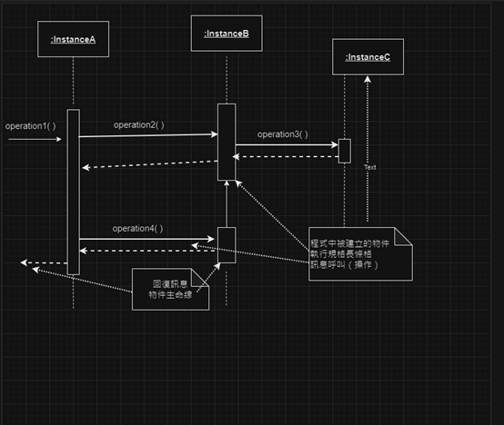

# 第2次隨堂-隨堂-QZ2
>
>學號：111111209
> 
>姓名：施柏賢
> 
>作業撰寫時間：180 (mins，包含程式撰寫時間)
> 
>最後撰寫文件日期：2024/05/06
>

本份文件包含以下主題：(至少需下面兩項，若是有多者可以自行新增)
- [x] 說明內容
- [x] 個人認為完成作業須具備觀念

## 說明程式與內容

## 個人認為完成作業須具備觀念
設計的基本概念就是將系統分割為一個最小且獨立的單位，最後再加以
整合，每一個小單位恰可解決一個完整的問題，同時要考量內聚力與耦
合力的問題。